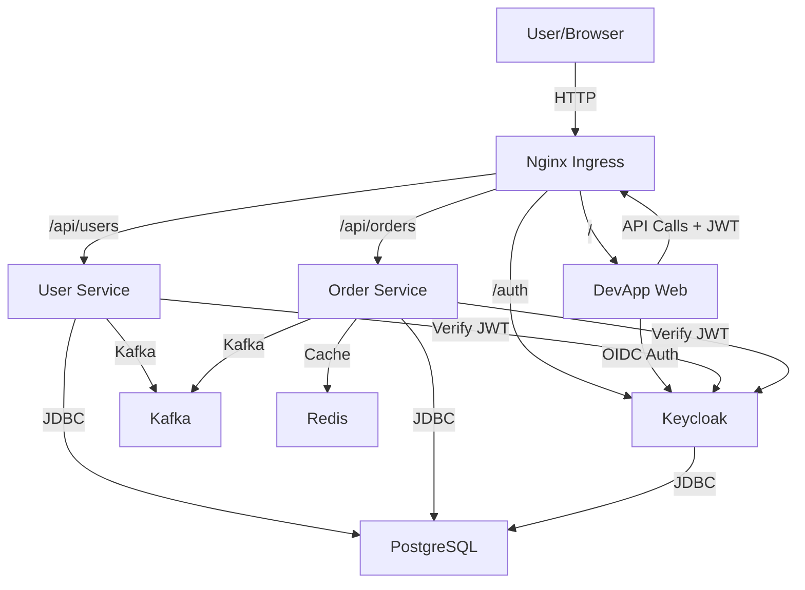
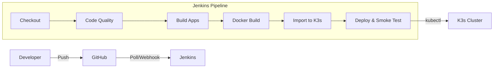

# DevApp

DevApp is a modern microservice architecture demonstration/template project featuring two Spring Boot services (`user-app` and `order-app`), an Angular frontend (`devapp-web`), and a comprehensive infrastructure stack deployed on **K3s** with **Longhorn** distributed storage, **Keycloak**, **Kafka**, and **PostgreSQL**.

## 🛠 Technologies Used

### Core Stack
*   **Backend**: Java 21, Spring Boot 3.5.3
*   **Frontend**: Angular 21
*   **Database**: PostgreSQL
*   **Messaging**: Kafka, Zookeeper
*   **Caching**: Redis
*   **Security**: Keycloak (OIDC/OAuth2)

### Infrastructure & DevOps
*   **Orchestration**: K3s (Lightweight Kubernetes)
*   **Storage**: Longhorn (distributed block storage)
*   **Ingress**: Nginx Ingress Controller
*   **Containerization**: Docker
*   **CI/CD**: Jenkins (K8s-native build agents)
*   **GitOps**: ArgoCD
*   **Code Quality**: SonarQube
*   **Artifacts**: Nexus Repository Manager OSS
*   **Monitoring**: Prometheus, Grafana
*   **Logging**: ELK Stack (Elasticsearch, Logstash, Kibana)
*   **Automation**: Ansible

> **Note on Nexus**: Nexus OSS supports Maven (JARs), NPM, and Docker repositories.
>
> *   ConfigMaps for `settings.xml` and `.npmrc` are deployed for Jenkins agents, but mirroring is disabled by default.
> *   **Setup Required**:
>     1.  Login to Nexus (`http://<SERVER_IP>:30005`), retrieve admin password: `kubectl exec -n infrastructure deployment/nexus -- cat /nexus-data/admin.password`
>     2.  Create repositories: Maven `maven-public` (Group proxying Central), NPM `npm-group`, Docker hosted on port 5000.
>     3.  Update `jenkins-maven-settings` and `jenkins-npm-config` ConfigMaps with credentials and uncomment the Nexus mirror configuration.

## 🏗 Architecture & Service Interaction

The application adopts a cloud-native architecture on a K3s Kubernetes cluster with Nginx Ingress for traffic management.

### Traffic Flow
1.  **Client/Browser** connects to the **Nginx Ingress Controller** (port 30090, or port 80 via iptables).
2.  **Ingress** routes traffic based on URI prefixes:
    *   `/` → **DevApp Web** (Angular Frontend)
    *   `/api/users/**` → **User Service**
    *   `/api/orders/**` → **Order Service**
    *   `/auth/**` → **Keycloak**
3.  **Authentication**:
    *   The frontend authenticates with **Keycloak** using OIDC (Authorization Code Flow + PKCE).
    *   API requests include the JWT in the `Authorization` header.
    *   Backend services validate the JWT as OAuth2 Resource Servers.

### Inter-Service Communication (Saga Pattern)
*   **Order Service** creates an order with status `PENDING` and publishes to Kafka topic `order_topic`.
*   **User Service** consumes the event, validates the user, sets status to `APPROVED`/`REJECTED`, and publishes to `order_result_topic`.
*   **Order Service** consumes the result and updates the order status in the database.

### Centralized Logging (ELK Stack)
*   **Logstash** collects logs from two sources:
    *   **TCP input** (port 5000): Application logs from user-app and order-app via logback TCP appender (JSON format).
    *   **Kafka input**: Order events from `order_topic` and `order_result_topic`.
*   **Elasticsearch** stores all logs in `devapp-logs-*` indices.
*   **Kibana** provides log visualization and search (port 30009).



## 🔄 CI/CD Pipeline

The CI/CD pipeline runs on **Jenkins** with Kubernetes-native build agents (pods spun up per build).

### Pipeline Stages



1.  **Checkout**: Pulls latest code from GitHub.
2.  **Code Quality** (parallel): Backend tests (Maven), Frontend lint & tests (npm).
3.  **Build Applications** (parallel): Maven package (fat JARs), Angular production build.
4.  **Docker Build**: Builds 3 Docker images (user-app, order-app, devapp-web).
5.  **Import to K3s**: Imports images directly into K3s containerd (no external registry needed).
6.  **Deploy & Smoke Test**: Updates K8s deployments with new image tags, verifies health endpoints.

### How It Works on K3s
Instead of pushing to a Docker registry, the pipeline:
- Builds Docker images using the host's Docker daemon (socket mounted into build pods).
- Saves images as tarballs to a shared volume.
- Uses `k3s ctr images import` to load them into K3s's containerd runtime.
- Updates deployments with `kubectl set image` for rolling updates.

## 📦 Current Deployment

### Service Access (replace `<SERVER_IP>` with your server's IP)

| Service | URL | Default Credentials |
|---------|-----|-------------------|
| **Frontend** | `http://<SERVER_IP>:30080` | — |
| **Frontend (Ingress)** | `http://<SERVER_IP>:30090` | — |
| **User API** | `http://<SERVER_IP>:30090/api/users` | JWT required |
| **Order API** | `http://<SERVER_IP>:30090/api/orders` | JWT required |
| **Actuator** | `http://<SERVER_IP>:30090/actuator/health` | — |
| **Jenkins** | `http://<SERVER_IP>:30000` | See setup below |
| **SonarQube** | `http://<SERVER_IP>:30002` | admin / admin |
| **Nexus** | `http://<SERVER_IP>:30005` | admin / (see pod) |
| **ArgoCD** | `http://<SERVER_IP>:30007` | admin / (see below) |
| **Prometheus** | `http://<SERVER_IP>:30003` | — |
| **Grafana** | `http://<SERVER_IP>:30004` | admin / admin |
| **Kibana** | `http://<SERVER_IP>:30009` | — |
| **Longhorn UI** | `kubectl port-forward -n longhorn-system svc/longhorn-frontend 8080:80` | — |

### K8s Namespaces

| Namespace | Contents |
|-----------|----------|
| `infrastructure` | PostgreSQL, Kafka, Zookeeper, Redis, Keycloak, Prometheus, Grafana, Jenkins, SonarQube, Nexus, ArgoCD, Nginx Ingress, ELK (Elasticsearch, Logstash, Kibana) |
| `devapp` | Application services (user-app, order-app, devapp-web) |
| `longhorn-system` | Longhorn storage manager |

## 🚀 Quick Start (Fresh Server)

### Prerequisites
- Ubuntu 22.04+ server with 8+ CPUs, 16+ GB RAM, 100+ GB disk
- Sudo access

### 1. Install System Dependencies
```bash
# Java 21
sudo apt install -y openjdk-21-jdk

# Maven
sudo apt install -y maven

# Node.js 24
curl -fsSL https://deb.nodesource.com/setup_24.x | sudo -E bash -
sudo apt install -y nodejs

# Docker
curl -fsSL https://get.docker.com | sh
sudo usermod -aG docker $USER

# Longhorn prerequisites
sudo apt install -y open-iscsi nfs-common
sudo systemctl enable --now iscsid
```

### 2. Install K3s
```bash
curl -sfL https://get.k3s.io | sh -s - --disable traefik --write-kubeconfig-mode 644

# Configure kubectl for your user
mkdir -p ~/.kube
sudo cp /etc/rancher/k3s/k3s.yaml ~/.kube/config
sudo chown $USER:$USER ~/.kube/config
```

### 3. Install Helm & Longhorn
```bash
curl https://raw.githubusercontent.com/helm/helm/main/scripts/get-helm-3 | bash

helm repo add longhorn https://charts.longhorn.io
helm repo update
helm install longhorn longhorn/longhorn --namespace longhorn-system --create-namespace \
    --set defaultSettings.defaultReplicaCount=1

# Set Longhorn as default StorageClass
kubectl patch storageclass longhorn -p '{"metadata":{"annotations":{"storageclass.kubernetes.io/is-default-class":"true"}}}'
kubectl patch storageclass local-path -p '{"metadata":{"annotations":{"storageclass.kubernetes.io/is-default-class":"false"}}}'
```

### 4. Install Nginx Ingress
```bash
helm repo add ingress-nginx https://kubernetes.github.io/ingress-nginx
helm install ingress-nginx ingress-nginx/ingress-nginx --namespace infrastructure \
    --set controller.service.type=NodePort \
    --set controller.service.nodePorts.http=30090 \
    --set controller.service.nodePorts.https=30443
```

### 5. Build the Application
```bash
cd /path/to/devapp

# Fix Maven proxy issue (Ubuntu 24.04)
export MAVEN_OPTS="-Dhttp.proxyHost= -Dhttps.proxyHost="

# Build backend
mvn clean package -DskipTests

# Build frontend
cd devapp-web && npm install && npm run build-prod && cd ..

# Build Docker images
docker build -t devapp/user-app:latest user-app/
docker build -t devapp/order-app:latest order-app/
docker build -t devapp/devapp-web:latest devapp-web/

# Import into K3s
docker save devapp/user-app:latest | sudo k3s ctr images import -
docker save devapp/order-app:latest | sudo k3s ctr images import -
docker save devapp/devapp-web:latest | sudo k3s ctr images import -
```

### 6. Deploy Everything
```bash
# Create namespaces
kubectl create namespace infrastructure
kubectl create namespace devapp

# Infrastructure (manifests include namespace: infrastructure)
kubectl apply -f deployment/k8s/postgres.yaml
kubectl apply -f deployment/k8s/kafka.yaml
kubectl apply -f deployment/k8s/redis.yaml
kubectl apply -f deployment/k8s/keycloak.yaml
kubectl apply -f deployment/k8s/monitoring.yaml

# ELK Stack
kubectl apply -f deployment/k8s/elk.yaml

# Wait for infra
kubectl wait --for=condition=ready pod -l app=postgres -n infrastructure --timeout=120s
kubectl wait --for=condition=ready pod -l app=kafka -n infrastructure --timeout=180s

# Application
kubectl apply -f deployment/k8s/app/ -n devapp

# CI/CD
kubectl apply -f deployment/k8s/jenkins.yaml
kubectl apply -f deployment/k8s/jenkins-config.yaml
kubectl apply -f deployment/k8s/sonarqube.yaml
kubectl apply -f deployment/k8s/nexus.yaml

# ArgoCD (installed via Helm)
helm repo add argo https://argoproj.github.io/argo-helm
helm install argocd argo/argo-cd -n infrastructure \
    --set server.service.type=NodePort \
    --set server.service.nodePortHttp=30007 \
    --set server.service.nodePortHttps=30008 \
    --set configs.params."server\.insecure"=true

# ArgoCD applications (GitOps sync)
kubectl apply -f deployment/k8s/argocd-apps.yaml

# Or use Ansible:
cd deployment/ansible
ansible-playbook deploy.yml
ansible-playbook deploy-cicd.yml

# Verify all pods
kubectl get pods -n infrastructure
kubectl get pods -n devapp
```

## 🔧 Manual Setup Required After Deployment

### 1. Keycloak Configuration (Required for Authentication)
```bash
# Access Keycloak admin console
# Default credentials: admin / admin (set via KEYCLOAK_ADMIN env in keycloak.yaml)
# URL: http://<SERVER_IP>:30090/auth (via ingress)

# You need to:
# 1. Create realm "devapp"
# 2. Create a client "devapp-web" with:
#    - Client Protocol: openid-connect
#    - Access Type: public
#    - Valid Redirect URIs: http://<SERVER_IP>:30080/*, http://<SERVER_IP>:30090/*
#    - Web Origins: *
# 3. Create test users
# 4. Update devapp-web/src/environments/environment.prod.ts if the Keycloak URL differs
```

### 2. Jenkins Setup (Required for CI/CD)
```bash
# Get initial admin password
kubectl exec -n infrastructure deployment/jenkins -- cat /var/jenkins_home/secrets/initialAdminPassword

# Access Jenkins at http://<SERVER_IP>:30000
# 1. Install suggested plugins + "Kubernetes" plugin
# 2. Configure Kubernetes cloud:
#    - Manage Jenkins → Clouds → New Cloud → Kubernetes
#    - Kubernetes URL: https://kubernetes.default.svc
#    - Jenkins URL: http://jenkins.infrastructure.svc.cluster.local:8080
#    - Jenkins tunnel: jenkins.infrastructure.svc.cluster.local:50000
#    - Namespace: infrastructure
# 3. Create a Pipeline job pointing to this Git repo
#    - SCM: Git → https://github.com/chefzaid/devapp.git
#    - Script Path: Jenkinsfile
```

### 3. ArgoCD Setup (GitOps)
```bash
# Get initial admin password
kubectl -n infrastructure get secret argocd-initial-admin-secret -o jsonpath="{.data.password}" | base64 -d

# Access ArgoCD at http://<SERVER_IP>:30007
# Login with admin / <password from above>
# Two applications are pre-configured:
#   - devapp-infra: watches deployment/k8s/ for infrastructure manifests
#   - devapp-apps: watches deployment/k8s/app/ for application manifests
# ArgoCD auto-syncs on git push (self-heal enabled)
```

### 4. Change Default Passwords (Security)
```bash
# PostgreSQL: Update secret in deployment/k8s/postgres.yaml (base64 encoded)
# Currently: devapp123 — change before production use!
echo -n 'YOUR_NEW_PASSWORD' | base64

# Keycloak admin password: Update KEYCLOAK_ADMIN_PASSWORD in keycloak.yaml
# SonarQube: Change admin password on first login
# Grafana: Change admin password on first login
# Nexus: Retrieve and change on first login
```

### 5. TLS/HTTPS (Recommended for Production)
```bash
# Option 1: cert-manager with Let's Encrypt
helm repo add jetstack https://charts.jetstack.io
helm install cert-manager jetstack/cert-manager --namespace cert-manager --create-namespace \
    --set installCRDs=true

# Then create a ClusterIssuer and update the Ingress with TLS annotations

# Option 2: Manual certificate
# Create a K8s TLS secret and reference it in the Ingress resource
kubectl create secret tls devapp-tls --cert=tls.crt --key=tls.key -n devapp
```

### 6. DNS Configuration
```
# Point your domain to the server IP:
# devapp.yourdomain.com → <SERVER_IP>
# Then update the Ingress host and Keycloak hostname accordingly
```

## 🔀 Adding More Nodes

K3s makes it easy to scale horizontally:

```bash
# On the master node, get the join token:
sudo cat /var/lib/rancher/k3s/server/node-token

# On the new worker node:
curl -sfL https://get.k3s.io | K3S_URL=https://<MASTER_IP>:6443 K3S_TOKEN=<TOKEN> sh -

# Longhorn will automatically replicate data to new nodes.
# Increase replica count:
kubectl edit settings -n longhorn-system default-replica-count
# Change from 1 to 2 (or 3 for 3+ nodes)
```

## 💻 Development

### Project Structure
-   `user-app/`: User microservice (Spring Boot, port 8080)
-   `order-app/`: Order microservice (Spring Boot, port 8081)
-   `devapp-web/`: Frontend (Angular 21, Nginx)
-   `devapp-common/`: Shared library (domain models, JWT, base entities)
-   `deployment/k8s/`: Kubernetes manifests (infrastructure in `infrastructure` ns, apps in `devapp` ns)
-   `deployment/k8s/app/`: Application deployment manifests
-   `deployment/k8s/argocd-apps.yaml`: ArgoCD Application definitions for GitOps
-   `deployment/ansible/`: Ansible playbooks for deployment automation
-   `Jenkinsfile`: CI/CD pipeline definition

### Running Locally
```bash
# Start infrastructure with Docker Compose (dev profile uses H2 by default)
cd devapp-web && npm start    # Frontend on :4200
cd user-app && mvn spring-boot:run   # User service on :8080
cd order-app && mvn spring-boot:run  # Order service on :8081
```

### Build & Test Commands
```bash
# Backend
mvn clean verify                           # Build + test all
mvn test -pl user-app -Dtest=UserServiceTest  # Single test

# Frontend
cd devapp-web
npm test           # Unit tests
npm run lint       # Linting
npm run build-prod # Production build
```

### Spring Profiles

| Profile | Database | Kafka | Redis |
|---------|----------|-------|-------|
| **dev** (default) | H2 in-memory | localhost:9092 | — |
| **test** | H2 in-memory | — | — |
| **prod** | PostgreSQL (env vars) | env: `KAFKA_BOOTSTRAP_SERVERS` | env: `REDIS_HOST` |

## 🛡 Security Notes

- **No secrets are committed to git**. All sensitive values (DB passwords, Keycloak admin credentials) are in K8s Secrets/ConfigMaps that must be created during deployment.
- The PostgreSQL password in `postgres.yaml` is base64-encoded (`devapp123`) — **change it before production use**.
- All API endpoints under `/api/*` require a valid JWT token.
- Public endpoints: `/actuator/health`, `/swagger-ui/**`, `/v3/api-docs/**`.

## 📊 Monitoring & Logging

- **Prometheus** scrapes metrics from user-app (`:8080/actuator/prometheus`), order-app (`:8081/actuator/prometheus`), Elasticsearch, and Kafka.
- **Grafana** connects to Prometheus and Elasticsearch datasources (auto-provisioned). Import Spring Boot dashboard ID `12900` for JVM metrics.
- **ELK Stack**: Application logs are shipped to Logstash (TCP appender in logback), stored in Elasticsearch, and searchable via Kibana.
- **Kibana**: Access at `http://<SERVER_IP>:30009`. Create an index pattern `devapp-logs-*` to browse application logs.

## 🧩 Key Configuration Changes Made During Deployment

These changes were made to adapt the application for K3s + Longhorn:

1. **`pom.xml`**: Added `repackage` execution goal to `spring-boot-maven-plugin` (required for fat JAR generation).
2. **`logback-spring.xml`** (both services): Changed `TimeBasedRollingPolicy` to `SizeAndTimeBasedRollingPolicy` (fixes crash with `%i` pattern).
3. **`RedisConfig.java`** (order-app): Removed custom `LettuceConnectionFactory` bean — was ignoring Spring properties and connecting to `localhost:6379`.
4. **`application.yml`** (both services): Changed prod `ddl-auto` from `validate` to `update` (no Flyway migrations exist).
5. **K8s manifests**: Added Longhorn `storageClassName`, `fsGroup` security contexts, `KAFKA_LOG_DIRS` subdirectory fix for Longhorn's `lost+found`.
6. **`Jenkinsfile`**: Rewritten for K3s — local image builds, containerd import, kubectl-based deployment.
7. **`nginx.conf`** (devapp-web): Added Keycloak reverse proxy configuration with FQDN for cross-namespace access.
8. **Namespace separation**: All infrastructure in `infrastructure` namespace, apps in `devapp` namespace. App manifests use FQDNs (e.g., `postgres.infrastructure.svc.cluster.local`) for cross-namespace service discovery.
9. **ArgoCD**: Installed via Helm, configured with two Application resources for GitOps sync of infrastructure and application manifests.
10. **Ansible playbooks**: Updated for new namespace structure (`infrastructure` + `devapp`).
11. **ELK Stack**: Elasticsearch with Longhorn PVC, Logstash with Kafka + TCP inputs, Kibana on NodePort 30009. All in `infrastructure` namespace.
12. **Istio removed**: Removed as overkill for single-node deployment; Nginx Ingress handles all routing.
13. **Kafka FQDN**: `KAFKA_ADVERTISED_LISTENERS` uses FQDN (`kafka.infrastructure.svc.cluster.local:9092`) for cross-namespace consumer compatibility.
14. **Logback TCP appender**: Both services ship logs to Logstash via `LogstashTcpSocketAppender` (JSON format) in prod profile.
15. **Grafana datasources**: Auto-provisioned with Prometheus and Elasticsearch datasources via ConfigMap.

## License
GPL 3.0

