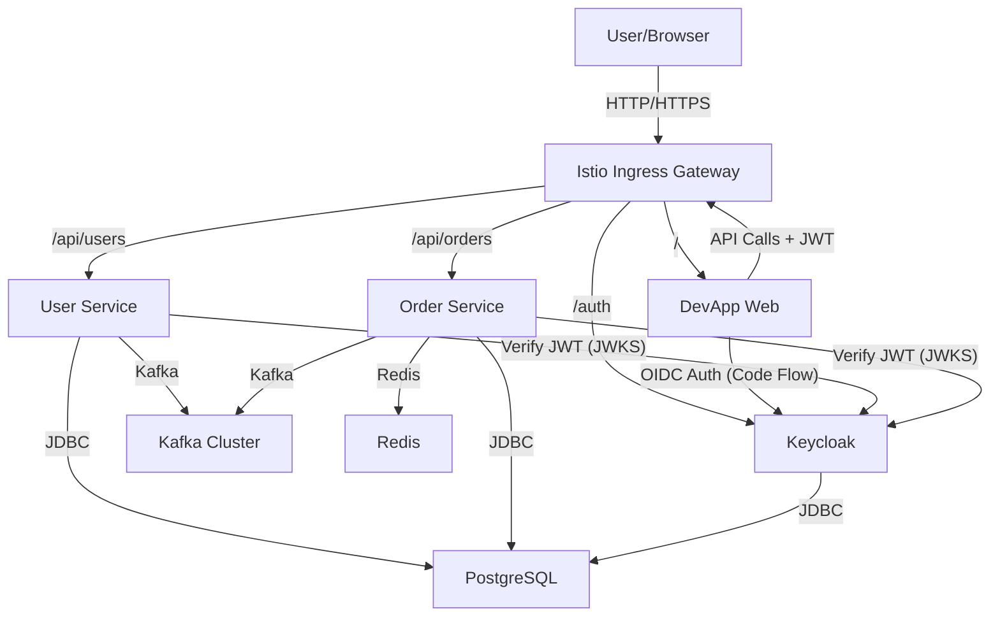

# DevApp

DevApp is a modern microservice architecture demonstration project featuring two Spring Boot services (`user-app` and `order-app`), an Angular frontend (`devapp-web`), and a comprehensive infrastructure stack including **Istio Service Mesh**, **Keycloak**, **Kafka**, and **PostgreSQL**.

## 🏗 Architecture

The application adopts a cloud-native architecture leveraging Kubernetes and Istio for traffic management and security.



### Key Components

*   **Istio Ingress Gateway**: Central entry point. Handles routing, load balancing, and edge authentication.
*   **Keycloak**: Identity and Access Management (IAM). Handles user authentication via OIDC and issues JWTs.
*   **DevApp Web**: Angular 20 frontend. Uses `angular-oauth2-oidc` for Single Sign-On (SSO).
*   **User Service**: Spring Boot microservice for user management. Acts as an OAuth2 Resource Server.
*   **Order Service**: Spring Boot microservice for order management. Acts as an OAuth2 Resource Server.
*   **Kafka & Zookeeper**: Stateful streaming platform for event-driven communication (Saga pattern). deployed as StatefulSets with persistent storage.
*   **PostgreSQL**: Shared relational database (with separate logical databases for services).

## 🚀 Quick Start

### Prerequisites
- Kubernetes Cluster (Minikube, Kind, or Cloud)
- Istio installed on the cluster
- `kubectl` configured

### Deployment

1.  **Deploy Infrastructure & Services**:
    ```bash
    ./deployment/deploy.sh
    ```
    This script builds the applications and applies Kubernetes manifests.

2.  **Access the Application**:
    -   **Frontend**: `http://localhost` (or your Ingress Gateway IP)
    -   **Keycloak**: `http://localhost/auth`
    -   **APIs**: `http://localhost/api/users`, `http://localhost/api/orders`

### Authentication
The application uses Keycloak for SSO.
-   **Login**: Click "Login with SSO" on the frontend. You will be redirected to Keycloak.
-   **Credentials**:
    -   Username: `user`
    -   Password: `password`
    -   (Admin) Username: `admin` / Password: `admin`

## 🛡 Security

-   **OIDC**: Frontend uses Authorization Code Flow with PKCE.
-   **JWT Validation**:
    -   **Istio**: Enforces valid tokens for `/api/*` endpoints at the gateway level (`RequestAuthentication` + `AuthorizationPolicy`).
    -   **Backend**: Services validate tokens locally using Spring Security OAuth2 Resource Server (verifying signature against Keycloak JWKS).
-   **Traffic Rules**:
    -   Public: `/`, `/auth`, `/assets`
    -   Protected: `/api/*`

## 💻 Development

### Project Structure
-   `user-app/`: Backend service (User domain)
-   `order-app/`: Backend service (Order domain)
-   `devapp-web/`: Frontend application (Angular)
-   `deployment/`: Kubernetes manifests, Istio config, and scripts

### Running Locally (Hybrid)
To run services locally while connecting to cluster infrastructure:
1.  Port-forward Keycloak: `kubectl port-forward svc/keycloak 8080:8080 -n devapp`
2.  Run Backend: `mvn spring-boot:run` (Ensure `application.yml` points to localhost for Keycloak).
3.  Run Frontend: `ng serve` (Proxy API calls to Ingress or backend).

## 🧪 Testing

```bash
# Backend
mvn clean verify

# Frontend
cd devapp-web
npm test
```
