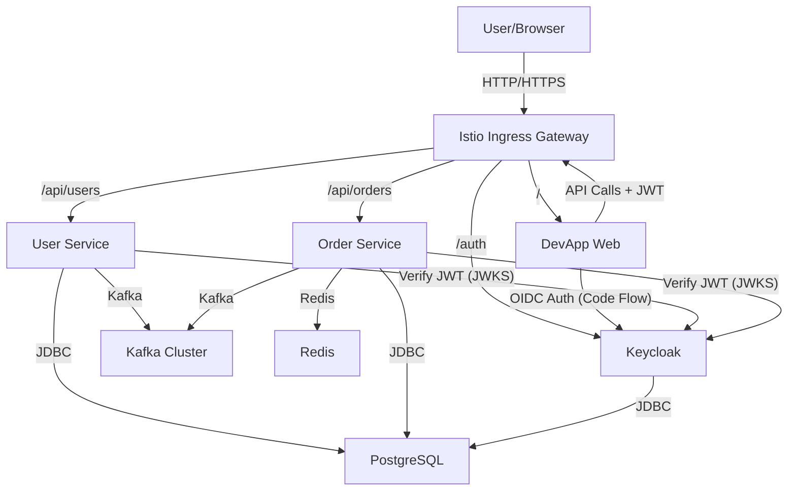

# DevApp

DevApp is a modern microservice architecture demonstration project featuring two Spring Boot services (`user-app` and `order-app`), an Angular frontend (`devapp-web`), and a comprehensive infrastructure stack including **Istio Service Mesh**, **Keycloak**, **Kafka**, and **PostgreSQL**.

## 🛠 Technologies Used

### Core Stack
*   **Backend**: Java 21, Spring Boot 3.5.3
*   **Frontend**: Angular 21
*   **Database**: PostgreSQL
*   **Messaging**: Kafka, Zookeeper
*   **Caching**: Redis
*   **Security**: Keycloak (OIDC/OAuth2)

### Infrastructure & DevOps
*   **Orchestration**: Kubernetes (K8s)
*   **Service Mesh**: Istio
*   **Containerization**: Docker
*   **CI/CD**: Jenkins, ArgoCD, Ansible, Git
*   **Monitoring**: Prometheus, Grafana
*   **Logging**: ELK Stack (Elasticsearch, Logstash, Kibana)
*   **Code Quality**: SonarQube
*   **Artifacts**: Artifactory (OSS) - configured with 40GB storage.

> **Note**: The Artifactory instance is the **OSS version**, which primarily supports Maven/Gradle (JARs). It does **not** natively support private Docker Registries or NPM repositories.
>
> *   **JARs**: Supported. A `settings.xml` ConfigMap is deployed and mounted in Jenkins, but active mirroring is commented out by default. You must configure repositories (`libs-release`, `libs-snapshot`) and remote proxies (e.g., to Maven Central) in the Artifactory UI, then uncomment the mirror configuration in the `jenkins-maven-settings` ConfigMap.
> *   **Docker/NPM**: Not supported by the OSS version. Builds will continue to use public registries (NPM Registry, Docker Hub) unless you upgrade to Artifactory Pro or JFrog Container Registry and update the build configuration.

## 🏗 Architecture & Service Interaction

The application adopts a cloud-native architecture leveraging Kubernetes and Istio for traffic management and security.

### Traffic Flow
1.  **Client/Browser** initiates requests to the **Istio Ingress Gateway**.
2.  **Istio Gateway** routes traffic based on URI prefixes:
    *   `/` -> **DevApp Web** (Angular Frontend)
    *   `/api/users/**` -> **User Service**
    *   `/api/orders/**` -> **Order Service**
    *   `/auth/**` -> **Keycloak**
3.  **Authentication**:
    *   The frontend authenticates with **Keycloak** using OIDC (Authorization Code Flow) to obtain a JWT.
    *   API requests include the JWT in the `Authorization` header.
    *   **Istio** validates the JWT at the gateway level.
    *   **Backend Services** (User/Order) act as Resource Servers and validate the JWT signature/roles locally.

### Inter-Service Communication
*   **Order Service** initiates an order creation process.
*   **Order Service** publishes an event to **Kafka** to validate the user.
*   **User Service** consumes the event, validates the user status, and publishes a result event back to **Kafka**.
*   **Order Service** consumes the result and updates the order status (Saga Pattern).



## 🔄 CI/CD Pipeline

The Continuous Integration and Continuous Deployment (CI/CD) pipeline is fully automated using **Jenkins**, **Ansible**, and **ArgoCD**.

### Workflow

```mermaid
graph LR
    Dev[Developer] -->|Push| Git[Git Repository]
    Git -->|Webhook| Jenkins[Jenkins CI]

    subgraph Jenkins Pipeline
        Checkout --> Tests
        Tests --> Quality[SonarQube]
        Quality --> Build
        Build --> Security[Trivy Scan]
        Security --> PushImage[Push to Registry]
        PushImage --> Ansible
    end

    Ansible -->|Apply Manifests| K8s[Kubernetes Cluster]

    Git -->|Sync (GitOps)| ArgoCD[ArgoCD]
    ArgoCD -.->|Reconcile| K8s

    style ArgoCD stroke-dasharray: 5 5
```

1.  **Git**: Developer pushes code to the repository.
2.  **Jenkins**: Detects changes and triggers the pipeline.
    *   **Checkout**: Pulls the latest code.
    *   **Tests**: Runs backend (Maven) and frontend (NPM) unit tests.
    *   **Quality Gate**: Analyzes code with **SonarQube**.
    *   **Build**: Builds JARs and Angular artifacts (stored in **Artifactory**).
    *   **Security Scan**: Checks dependencies (OWASP Dependency Check) and scans Docker images (Trivy).
    *   **Integration Tests**: Spins up a test environment (Docker Compose) and runs integration tests.
    *   **Push**: Pushes Docker images to the registry (or **Artifactory** Docker registry).
    *   **Deploy (Staging)**: Uses **Ansible** to deploy manifests to the staging namespace in Kubernetes.
    *   **Smoke Tests**: Verifies the deployment health.
    *   **Deploy (Production)**: Uses **Ansible** (after manual approval) to deploy to the production namespace.

### Infrastructure Management
*   **ArgoCD**: Configured to monitor the `deployment/k8s` directory, enabling a GitOps workflow. While the active CI/CD pipeline uses Jenkins and Ansible for push-based deployments (modifying image tags dynamically), ArgoCD can be used to ensure the cluster state matches the git repository (reconciling to the versions defined in Git).
*   **Ansible**: Used by the Jenkins pipeline to template and apply application manifests (`deployment/ansible/deploy.yml`).

## 🚀 Quick Start

### Prerequisites
- Kubernetes Cluster (Minikube, Kind, or Cloud)
- Istio installed on the cluster
- `kubectl` configured

### Deployment

1.  **Deploy Infrastructure & Services**:
    ```bash
    ./deployment/deploy.sh
    ```
    This script builds the applications and applies Kubernetes manifests.

2.  **Access the Application**:
    -   **Frontend**: `http://localhost` (or your Ingress Gateway IP)
    -   **Keycloak**: `http://localhost/auth`
    -   **APIs**: `http://localhost/api/users`, `http://localhost/api/orders`

### Authentication
The application uses Keycloak for SSO.
-   **Login**: Click "Login with SSO" on the frontend. You will be redirected to Keycloak.
-   **Credentials**:
    -   Username: `user`
    -   Password: `password`
    -   (Admin) Username: `admin` / Password: `admin`

## 🛡 Security

-   **OIDC**: Frontend uses Authorization Code Flow with PKCE.
-   **JWT Validation**:
    -   **Istio**: Enforces valid tokens for `/api/*` endpoints at the gateway level (`RequestAuthentication` + `AuthorizationPolicy`).
    -   **Backend**: Services validate tokens locally using Spring Security OAuth2 Resource Server (verifying signature against Keycloak JWKS).
-   **Traffic Rules**:
    -   Public: `/`, `/auth`, `/assets`
    -   Protected: `/api/*`

## 💻 Development

### Project Structure
-   `user-app/`: Backend service (User domain)
-   `order-app/`: Backend service (Order domain)
-   `devapp-web/`: Frontend application (Angular)
-   `deployment/`: Kubernetes manifests, Istio config, and scripts

### Running Locally (Hybrid)
To run services locally while connecting to cluster infrastructure:
1.  Port-forward Keycloak: `kubectl port-forward svc/keycloak 8080:8080 -n devapp`
2.  Run Backend: `mvn spring-boot:run` (Ensure `application.yml` points to localhost for Keycloak).
3.  Run Frontend: `ng serve` (Proxy API calls to Ingress or backend).

## 🧪 Testing

```bash
# Backend
mvn clean verify

# Frontend
cd devapp-web
npm test
```
