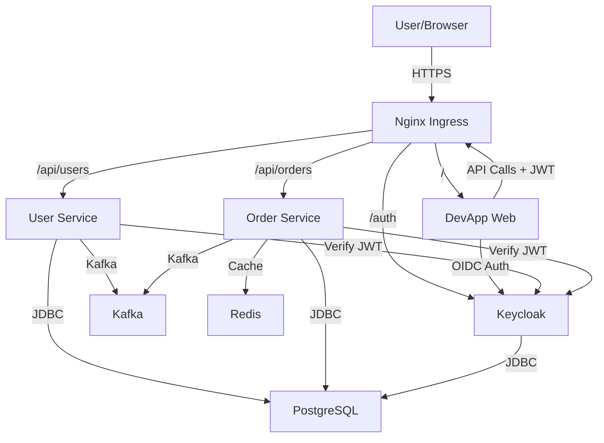
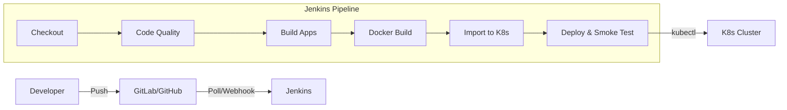

# DevApp

DevApp is a modern microservice architecture demonstration/template project focused on the **application layer**: two Spring Boot services (`user-app`, `order-app`), an Angular frontend (`devapp-web`), and a shared library (`devapp-common`).

> Necessary infrastructure to run the app is in: **https://github.com/chefzaid/ds-cluster**.

## 🛠 Technologies Used

### Core Stack
*   **Backend**: Java 21, Spring Boot 3.5.3
*   **Frontend**: Angular 21
*   **Database**: PostgreSQL
*   **Messaging**: Kafka, Zookeeper
*   **Caching**: Redis
*   **Security**: Keycloak (OIDC/OAuth2)

## 🏗 Architecture & Service Interaction

The application adopts a cloud-native architecture behind Kubernetes ingress routing.

### Traffic Flow
1.  **Client/Browser** connects to ingress over HTTPS.
2.  **Ingress** routes traffic based on URI prefixes:
    *   `/` → **DevApp Web** (Angular Frontend)
    *   `/api/users/**` → **User Service**
    *   `/api/orders/**` → **Order Service**
    *   `/auth/**` → **Keycloak**
3.  **Authentication**:
    *   The frontend authenticates with **Keycloak** using OIDC (Authorization Code Flow + PKCE).
    *   API requests include the JWT in the `Authorization` header.
    *   Backend services validate the JWT as OAuth2 Resource Servers.

### Inter-Service Communication (Saga Pattern)
*   **Order Service** creates an order with status `PENDING` and publishes to Kafka topic `order_topic`.
*   **User Service** consumes the event, validates the user, sets status to `APPROVED`/`REJECTED`, and publishes to `order_result_topic`.
*   **Order Service** consumes the result and updates the order status in the database.


```mermaid
graph TD
    User[User/Browser] -->|HTTPS| Ingress[Nginx Ingress]
    Ingress -->|/| Web[DevApp Web]
    Ingress -->|/api/users| UserApp[User Service]
    Ingress -->|/api/orders| OrderApp[Order Service]
    Ingress -->|/auth| Keycloak[Keycloak]

    Web -- OIDC Auth --> Keycloak
    Web -- API Calls + JWT --> Ingress

    UserApp -- Verify JWT --> Keycloak
    OrderApp -- Verify JWT --> Keycloak

    UserApp -- Kafka --> Kafka[Kafka]
    OrderApp -- Kafka --> Kafka

    UserApp -- JDBC --> Postgres[PostgreSQL]
    OrderApp -- JDBC --> Postgres
    Keycloak -- JDBC --> Postgres
    OrderApp -- Cache --> Redis[Redis]
```

## ♾️ CI/CD Pipeline

The app CI/CD pipeline runs on **Jenkins** with Kubernetes-native build agents.

### Pipeline Stages


```mermaid
graph LR
    Dev[Developer] -->|Push| Git[GitLab/GitHub]
    Git -->|Poll/Webhook| Jenkins[Jenkins]

    subgraph Jenkins Pipeline
        Checkout --> Quality[Code Quality]
        Quality --> Build[Build Apps]
        Build --> DockerBuild[Docker Build]
        DockerBuild --> Import[Import to K8s]
        Import --> Deploy[Deploy & Smoke Test]
    end

    Deploy -->|kubectl| K8s[K8s Cluster]
```

1.  **Checkout**: Pulls latest code.
2.  **Code Quality** (parallel): Backend tests (Maven), Frontend lint & tests (npm).
3.  **Build Applications** (parallel): Maven package (fat JARs), Angular production build.
4.  **Docker Build**: Builds 3 Docker images (user-app, order-app, devapp-web).
5.  **Import to K8s**: Imports images directly into K8s containerd.
6.  **Deploy & Smoke Test**: Updates K8s deployments with new image tags, verifies health endpoints.

### How It Works on K8s
- Builds Docker images using the host's Docker daemon.
- Saves images as tarballs to a shared volume.
- Uses `k3s ctr images import` to load them into K8s containerd.
- Updates deployments with rolling updates.

## 📦 Current Deployment

### Service Access

> Ingress public IP: **`51.68.232.240`**  
> Internal ClusterIP values below reflect the current cluster state and may change if services are recreated.

#### DevApp Services

| Service | Endpoint (Domain **or** IP:Port) | Access | Use |
|---------|----------------------------------|--------|-----|
| **DevApp Web** | `https://devapp.swirlit.dev` | Public | Main frontend UI |
| **User API** | `https://devapp.swirlit.dev/api/users` | Public | User CRUD API (JWT required) |
| **Order API** | `https://devapp.swirlit.dev/api/orders` | Public | Order CRUD/Saga API (JWT required) |
| **user-app service** | `10.43.199.19:8080` | Internal | Backend service target for ingress `/api/users`, scraped by Prometheus |
| **order-app service** | `10.43.96.172:8081` | Internal | Backend service target for ingress `/api/orders`, scraped by Prometheus |
| **devapp-web service** | `10.43.129.141:80` | Internal | Frontend service target for ingress `/` |

## 🚀 Quick Start (Application Deploy)

### Prerequisites
- Application infrastructure must already be deployed from `ds-cluster`.
- Ubuntu/Linux host with Docker, Maven, Node.js/npm, kubectl access.

### Build & Deploy Application

```bash
export MAVEN_OPTS="-Dhttp.proxyHost= -Dhttps.proxyHost="
mvn clean package -DskipTests
cd devapp-web && npm install && npm run build-prod && cd ..
sudo docker build -t devapp/user-app:latest user-app/
sudo docker build -t devapp/order-app:latest order-app/
sudo docker build -t devapp/devapp-web:latest devapp-web/
sudo docker save devapp/user-app:latest | sudo k3s ctr images import -
sudo docker save devapp/order-app:latest | sudo k3s ctr images import -
sudo docker save devapp/devapp-web:latest | sudo k3s ctr images import -
kubectl create namespace devapp

# Create TLS secret for app ingress
kubectl create secret tls swirlit-dev-tls --cert=tls.crt --key=tls.key -n devapp --dry-run=client -o yaml | kubectl apply -f -

kubectl apply -f deployments/user-app.yaml
kubectl apply -f deployments/order-app.yaml
kubectl apply -f deployments/devapp-web.yaml
kubectl apply -f deployments/ingress.yaml
```

## 🔧 Post-Install Checklist (Application)

### 1. DNS Record in Cloudflare (Required)

Create DNS record for app traffic:

| Type | Name | Value | Proxy |
|------|------|-------|-------|
| A | `devapp` | `51.68.232.240` | Proxied (orange cloud) |

### 2. Keycloak Verification
The `devapp` realm and `devapp-web` client are imported by infrastructure setup. Verify login and create additional users at:

```bash
# URL: https://keycloak.swirlit.dev
# Default credentials: admin / admin
```

## 💻 Development

### Dev Container (Recommended)

The fastest way to get a complete development environment with dependencies pre-configured.

**Prerequisites**: [Docker](https://www.docker.com/) and [VS Code](https://code.visualstudio.com/) with the [Dev Containers extension](https://marketplace.visualstudio.com/items?itemName=ms-vscode-remote.remote-containers).

**Quick Start**:
1. Open this project in VS Code
2. Click "Reopen in Container" when prompted (or `Ctrl+Shift+P` → "Dev Containers: Reopen in Container")
3. Wait for the container to build and install dependencies
4. Start developing — all tools and services are ready

**What's Included**:
- Java 21, Maven 3.9.x, Node.js 24.x, Angular CLI 21
- Pre-installed VS Code extensions for Java, Angular, Spring Boot, Docker, Git
- By default, only the dev container runs; Kafka/Redis/Keycloak/PostgreSQL can be started on-demand with Docker Compose profile `local-infra` (or point to shared infra via env vars such as `KAFKA_BOOTSTRAP_SERVERS`, `REDIS_HOST`, `JWT_ISSUER_URI`, `DB_HOST`)

**Service URLs** (inside the dev container):

| Service | URL |
|---------|-----|
| Angular Dev Server | http://localhost:4200 |
| User Service | http://localhost:8080 |
| Order Service | http://localhost:8081 |
| H2 Console | http://localhost:8080/h2-console |
| Keycloak Admin | http://localhost:8180 (admin/admin) |
| Swagger (User) | http://localhost:8080/swagger-ui.html |
| Swagger (Order) | http://localhost:8081/swagger-ui.html |

**Starting Services**:
```bash
# Simplified commands
mask run        # default: all (user-app + order-app + frontend)
mask run front
mask run user
mask run order
```

**Optional local infrastructure**:
```bash
cd .devcontainer
docker compose --profile local-infra up -d
```

**Kafka Management** (when running `local-infra`):
```bash
bash .devcontainer/scripts/kafka-setup.sh setup      # Create topics
bash .devcontainer/scripts/kafka-setup.sh check       # Check connectivity
bash .devcontainer/scripts/kafka-setup.sh test-order  # Send test message
```

**Troubleshooting**:
- Container won't start: Ensure Docker has 4GB+ memory; try "Dev Containers: Rebuild Container"
- Services won't start: Use `./stop-all.sh` to stop any existing processes, check terminal logs
- Database issues: H2 Console at http://localhost:8080/h2-console, JDBC URL `jdbc:h2:mem:userdb` or `jdbc:h2:mem:orderdb`, username `sa`, empty password

### Running Without Dev Container

```bash
# Start application services directly
cd devapp-web && npm start    # Frontend on :4200
cd user-app && mvn spring-boot:run   # User service on :8080
cd order-app && mvn spring-boot:run  # Order service on :8081
```

### Project Structure
-   `user-app/`: User microservice (Spring Boot, port 8080)
-   `order-app/`: Order microservice (Spring Boot, port 8081)
-   `devapp-web/`: Frontend (Angular 21, Nginx)
-   `devapp-common/`: Shared library (domain models, JWT, base entities)
-   `deployments/`: App deployment manifests (including `argocd-apps.yaml`)
-   `Jenkinsfile`: CI/CD pipeline definition

### Build & Test Commands
```bash
# Backend
mvn clean verify                           # Build + test all
mvn test -pl user-app -Dtest=UserServiceTest  # Single test
# Ensure Java 21 is active (project target) when running Maven locally

# Frontend
cd devapp-web
npm test           # Unit tests
npm run lint       # Linting
npm run build:uat  # UAT build (environment.uat.ts)
npm run build-prod # Production build

# Simplified top-level commands
mask test back
mask test front
mask coverage back
mask coverage front
mask build back
mask build front
```

### Spring Profiles

| Profile | Database | Kafka | Redis | Keycloak realm |
|---------|----------|-------|-------|---------------|
| **dev** (default) | H2 in-memory | `KAFKA_BOOTSTRAP_SERVERS` (default localhost) | optional | `devapp` |
| **uat** | PostgreSQL (env vars) | `kafka.infrastructure.svc.cluster.local:9092` (overrideable) | `redis.infrastructure.svc.cluster.local` (overrideable) | `devapp-uat` |
| **test** | H2 in-memory | — | — | test config |
| **prod** | PostgreSQL (env vars) | env: `KAFKA_BOOTSTRAP_SERVERS` | env: `REDIS_HOST` | env: `JWT_ISSUER_URI` |

## �� Security Notes

- All API endpoints under `/api/*` require a valid JWT token.
- Public endpoints: `/actuator/health`, `/swagger-ui/**`, `/v3/api-docs/**`.

## 🔄 Deployment Methods: Script vs Ansible

Two application deployment methods are provided:

### Shell Script (`install-devapp.sh`)
**Best for**: Single-server app rollout after infrastructure exists.

```bash
./install-devapp.sh --yes --version latest
```

### Ansible Playbook (`ansible/deploy-app.yml`)
**Best for**: Repeatable app deployment automation.

```bash
cd ansible
ansible-playbook deploy-app.yml
```

## License
GPL 3.0
