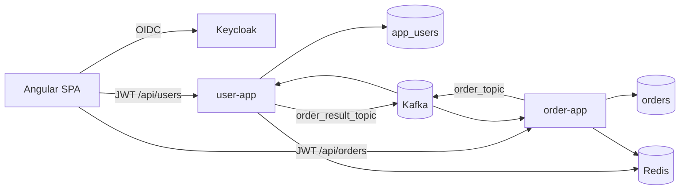
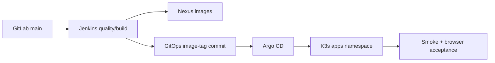

# Architecture Overview And ADR Index

This directory contains DevApp architecture decision records. ADRs explain why the template demonstrates a pattern, where its boundary is, and what future changes must preserve or deliberately replace.

## System Architecture At A Glance



Delivery:



## Service Architecture

`devapp-common` contains only cross-cutting contracts and infrastructure:

- auditing base/configuration
- `OrderStatus` and `OrderEvent`
- Kafka topics/retry/DLT wiring
- Problem Details handling
- request-ID and rate-limit filters

Each deployable service owns:

- controller: HTTP mapping
- DTO: supported request/response contract
- service/listener: transactions, orchestration, and event state
- repository: persistence access
- domain: service-owned JPA entity
- config: caching, health, and security
- resources: profiles, logging, migrations, and local seed SQL

Service-owned entities do not live in the shared module. Services share an event contract, not repositories or direct database access.

## Frontend Architecture

`devapp-web` is a standalone Angular application with:

- lazy route components for login, users, and orders
- functional routing, auth guard, and HTTP interceptor
- typed API service/model pairs
- observable authentication and notification state
- relative `/api` routing and canonical public Keycloak authentication
- Vitest at the unit/component layer
- Playwright for critical cross-system journeys
- unprivileged NGINX production runtime

The UI stays deliberately small so infrastructure and delivery behavior remain visible.

## Key Runtime Lifecycles

### Authenticated API request

1. Angular loads Keycloak OIDC discovery.
2. Authorization Code + PKCE authenticates the browser.
3. The interceptor adds the access token to an API request.
4. Spring Security validates the JWT issuer/signature/time claims.
5. the request-ID filter validates or creates `X-Request-Id`.
6. the rate limiter accounts by principal.
7. controller validates DTO/path/query values.
8. service executes a transaction and repository/cache work.
9. response DTO hides persistence-only fields.
10. logs and errors carry the request ID.

### Order creation and validation

1. authenticated caller creates an order.
2. `order-app` persists it as `PENDING`.
3. when messaging is enabled, `order-app` publishes keyed `OrderEvent` to `order_topic`.
4. `user-app` resolves the user.
5. missing user becomes a normal `REJECTED` result; transient failures propagate for retry.
6. `user-app` awaits result publication to `order_result_topic`.
7. `order-app` validates identifiers, status, and current state.
8. exact duplicates are ignored; a pending order becomes approved or rejected.
9. affected cache data is evicted.

The initial database commit and Kafka publication are not atomic. This is a documented outbox roadmap item.

### Deployment

1. Jenkins checks out GitLab `main`.
2. backend and frontend quality gates run in parallel.
3. verified artifacts are packaged into runtime images.
4. Kaniko pushes immutable images to Nexus.
5. Jenkins confirms Git did not advance, updates only Kustomize tags, and pushes a `[skip ci]` commit.
6. Argo CD reconciles that commit into K3s.
7. Jenkins waits for the exact revision to become healthy.
8. internal smoke and real Keycloak browser acceptance run.

## Data Ownership Rules

- `user-app` owns `app_users`.
- `order-app` owns `orders`.
- `orders.user_id` is a logical reference, not a foreign key.
- services do not query one another's repositories/tables.
- Kafka performs cross-service validation.
- both services may share a PostgreSQL schema operationally while keeping separate Flyway histories.
- Redis values are disposable caches.
- Keycloak owns credentials and authentication identity.

## Template Constraints

- Product behavior stays minimal and subordinate to reusable technical examples.
- Optional infrastructure must not make the fast default profile difficult to run.
- Failure behavior, operations, tests, and removal points are part of each reusable pattern.
- Distributed patterns are introduced only with a demonstrable failure mode.
- Documentation must distinguish current implementation from roadmap direction.

## ADR Process

Add an ADR when a change:

- changes service or frontend boundaries
- changes data/event ownership or compatibility
- introduces a material runtime dependency
- changes authentication, authorization, privacy, or secret flow
- changes transaction/retry/idempotency guarantees
- changes delivery or operational ownership
- constrains how template adopters can extend/remove a capability

Use the next sequence number:

```text
NNNN-short-title.md
```

Statuses:

- **Proposed**: under review, not a stable template decision
- **Accepted**: current direction
- **Superseded**: retained for history and linked to replacement

## Accepted ADRs

- [ADR 0001: Split Detailed Documentation Out Of The Root README](./adr/0001-documentation-structure.md)
- [ADR 0002: Keep A Minimal Domain Across Two Independently Deployable Services](./adr/0002-minimal-domain-microservices.md)
- [ADR 0003: Use The Java, Angular, And Shared Platform Stack](./adr/0003-platform-stack-and-profiles.md)
- [ADR 0004: Coordinate Services Asynchronously Through Kafka](./adr/0004-kafka-event-coordination.md)
- [ADR 0005: Delegate Authentication To Keycloak And Validate JWTs At Each API](./adr/0005-keycloak-jwt-security.md)
- [ADR 0006: Use Service-Owned Flyway Histories In The Shared PostgreSQL Schema](./adr/0006-service-owned-flyway.md)
- [ADR 0007: Deliver Through Jenkins, Immutable Images, And Argo CD](./adr/0007-jenkins-argocd-gitops.md)
- [ADR 0008: Keep Verification Layered And Continuous](./adr/0008-code-quality-and-verification.md)

## Proposed ADRs For Roadmap Work

Create decisions before implementing:

- transactional outbox relay and durable inbox/deduplication
- HTTP resilience reference adapter
- distributed rate limiting and edge ownership
- role/authority mapping and method authorization
- event schema compatibility and contract testing
- envelope encryption and key rotation
- OpenTelemetry context across HTTP/Kafka
- environment overlays, autoscaling, disruption, and canary policy
- shared internal Spring starters versus copyable source modules

## ADR Template

```markdown
# ADR NNNN: Title

- Status: Proposed | Accepted | Superseded
- Date: YYYY-MM-DD

## Context

What forces, constraints, and current facts made this decision necessary?

## Decision

What did we decide?

## Rationale

Why this option over the alternatives?

## Consequences

What becomes easier, harder, riskier, or more constrained?
```

## Related Guides

- [Features](./features.md)
- [Data Model](./data-model.md)
- [Development](./development.md)
- [Testing](./testing.md)
- [Deployment](./deployment.md)
- [Operations](./operations.md)
- [Security](./security.md)
