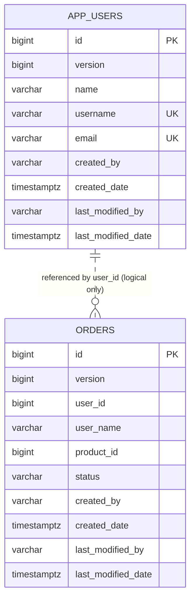

# Data Model Reference

DevApp intentionally uses only two application tables and one event contract. The small model makes persistence, migration, caching, auditing, concurrency, and cross-service messaging behavior easy to see.

## Relationship Overview

`orders.user_id` is a logical service reference, not a database foreign key. `user-app` owns user validation; `order-app` does not join or query the user table.

## Shared Base Entity

Both entities inherit these persistence fields from `devapp-common`:

| Field | Type | Purpose |
|---|---|---|
| `version` | `long` | JPA optimistic-lock value; internal and omitted from API DTOs |
| `createdBy` | `String` | authenticated principal that created the row, or `system` |
| `createdDate` | `Instant` | creation timestamp |
| `lastModifiedBy` | `String` | most recent modifying principal, or `system` |
| `lastModifiedDate` | `Instant` | most recent modification timestamp |

`@EnableJpaAuditing` activates timestamps and principals. `AuditorAwareImpl` uses the Spring Security authentication name and falls back to `system` when no authenticated principal exists.

Audit principals and optimistic-lock versions are persistence concerns. Public `UserResponse` and `OrderResponse` records expose audit timestamps but not principals or versions.

## User

Owner: `user-app`

Table: `app_users`

| Column | Constraint | API behavior |
|---|---|---|
| `id` | identity primary key | returned as resource identifier |
| `name` | required, maximum 120 characters | trimmed before storage |
| `username` | required, unique, maximum 80 characters | validated, trimmed, lowercased with `Locale.ROOT` |
| `email` | required, unique, maximum 180 characters | email-validated, trimmed, lowercased with `Locale.ROOT` |
| base fields | optimistic locking and audit metadata | only audit timestamps are returned |

Creation fails fast when normalized username or email already exists. Database unique constraints remain the authoritative race-safe enforcement and are mapped to HTTP `409 Conflict`.

The model has no password column. Keycloak owns identities and credentials; an application `User` is demonstration directory data rather than the authentication account record.

## Order

Owner: `order-app`

Table: `orders`

| Column | Constraint | API behavior |
|---|---|---|
| `id` | identity primary key | returned as resource identifier and Kafka key |
| `user_id` | required | logical reference validated asynchronously by `user-app` |
| `user_name` | optional | populated from an approved result; null for pending/rejected orders |
| `product_id` | required | opaque positive identifier used only to demonstrate a second reference |
| `status` | required, maximum 20 characters | enum string |
| base fields | optimistic locking and audit metadata | only audit timestamps are returned |

New orders start as `PENDING`.

Supported enum values:

- `PENDING`: saved and awaiting validation
- `APPROVED`: referenced user exists
- `REJECTED`: referenced user does not exist
- `COMPLETED`: reserved by the enum but no completion feature is currently implemented

The result listener accepts only `APPROVED` and `REJECTED` events. It verifies order, user, and product identity; ignores an exact duplicate result; and rejects any other transition from a non-pending order.

## Event Contract

`OrderEvent` is an immutable Java record:

| Field | Type | Meaning |
|---|---|---|
| `orderId` | `Long` | persisted order identifier and Kafka record key |
| `userId` | `Long` | logical user reference |
| `productId` | `Long` | product reference carried through validation |
| `userName` | `String` | null in the request; resolved name in an approved result |
| `status` | `OrderStatus` | pending request or approved/rejected result |
| `occurredAt` | `Instant` | event creation time |

Topics:

- `order_topic`: order validation requests
- `order_result_topic`: validation results
- `order_topic.DLT`: exhausted or rejected request records
- `order_result_topic.DLT`: exhausted or rejected result records

Records are keyed by stringified order ID. Ordering is therefore expected only for one order within a partition, not globally across all orders.

The event is serialized as JSON. There is not yet a schema registry or formal compatibility policy; that work is tracked in [TODO.md](../TODO.md).

## Service Data Ownership

Rules:

- `user-app` owns `app_users` and never writes orders.
- `order-app` owns `orders` and never reads the user table.
- cross-service identity is carried through Kafka, not database joins.
- both services currently share one PostgreSQL database/schema supplied by the platform.
- separate Flyway history tables prevent one service from treating the other service's migrations as its own.
- application code should not rely on physical co-location; the tables may be moved to separate databases later without changing the logical contract.

No database foreign key links `orders.user_id` to `app_users.id`. This preserves service ownership at the cost of eventual validation and possible temporary `PENDING` state.

## Transactions And Consistency

Current transaction boundaries:

- collection and single-resource queries are read-only transactions
- user and order creates are write transactions
- applying an order result is a write transaction
- Kafka consumption acknowledges one record at a time

Important consistency boundary:

1. `order-app` inserts the order in a database transaction.
2. It sends the Kafka event from application code.
3. Those two operations are not one atomic commit.

Kafka producer idempotence prevents duplicate records caused by producer retries, but it does not solve a process failure between the database commit and publish. A transactional outbox is the planned reusable solution.

Consumer behavior is idempotent for repeated final results in current process state, but there is no durable inbox table. A durable processed-event key is planned for stronger duplicate protection.

## Caching Rules

- `users` caches individual user lookups by ID.
- `orders` caches individual order lookups by ID.
- list queries are intentionally not cached.
- creates evict the relevant cache region.
- order-result processing evicts the affected order key.
- UAT and production Redis entries expire after ten minutes.
- the default development profile uses an in-memory cache.

The database remains authoritative. Cache contents are rebuildable and should not carry unique business state.

## Database Initialization And Migrations

Default development profile:

- H2 in PostgreSQL compatibility mode
- `db/schema.sql` creates the table
- `db/data.sql` inserts deterministic demonstration rows
- Flyway disabled
- Hibernate DDL disabled

UAT and production profiles:

- PostgreSQL driver and credentials from environment variables
- SQL initialization disabled
- Flyway enabled
- Hibernate `ddl-auto: validate`
- H2 console disabled

Migration locations and history tables:

| Service | Migration location | History table |
|---|---|---|
| `user-app` | `user-app/src/main/resources/db/migration` | `flyway_schema_history_users` |
| `order-app` | `order-app/src/main/resources/db/migration` | `flyway_schema_history_orders` |

Both use `baseline-on-migrate` with baseline version `0`. This lets either service initialize its own history in a shared, already non-empty schema while still running versioned migrations. Current migrations create the service table and add the optimistic-lock column safely for older installations.

## Schema Change Rules

When changing persistence:

1. Update the owning entity and API DTOs deliberately.
2. Add the next immutable Flyway migration to the owning service.
3. Keep H2 `db/schema.sql` aligned for the default profile.
4. Update seed data when the minimal demonstration requires it.
5. Add migration and behavior tests at the appropriate layer.
6. Confirm `mvn clean verify` and a production-profile PostgreSQL startup.
7. Update this reference and any affected ADR.

Never edit an applied Flyway migration in place. Add a new version.

## Privacy And Retention

User name, username, email, audit principals, and logs can contain personal data. The template currently demonstrates access control and API minimization, but it does not implement retention, export, erasure, or field-level encryption.

Passwords remain outside this model in Keycloak. Email cannot be irreversibly hashed because the demo displays it. Deployments with a stronger threat model should use storage encryption and may add application-level envelope encryption with a managed KMS.

## Related Guides

- [Features](./features.md)
- [Security](./security.md)
- [Development](./development.md)
- [Testing](./testing.md)
- [Architecture and ADRs](./architecture.md)
