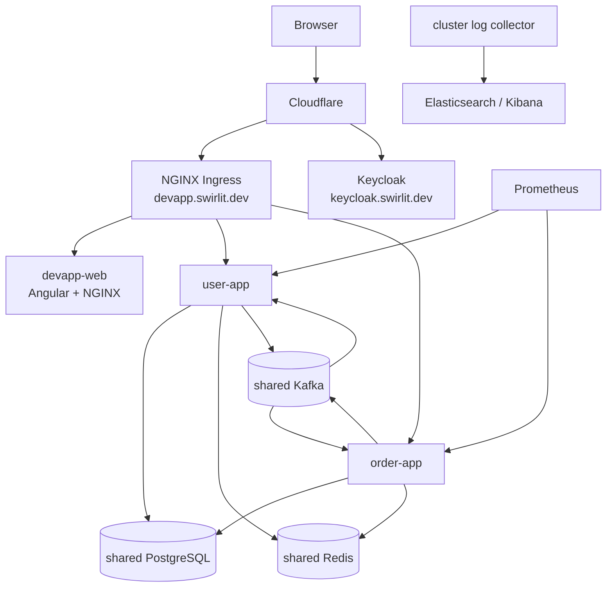
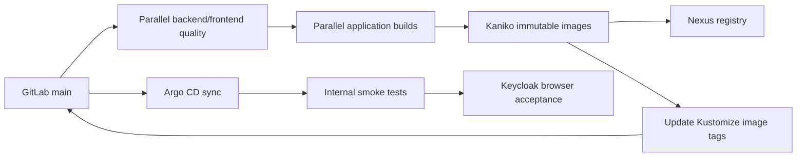

# Deployment Guide

DevApp targets the K3s platform managed by [`bm-cluster`](https://github.com/chefzaid/bm-cluster). This repository owns application images, Kubernetes desired state, CI orchestration, public DNS, dashboard metadata, registry-secret reconciliation, CI permissions, and application-specific observability. The platform repository stays application-agnostic and owns shared PostgreSQL, Redis, Kafka, Keycloak, Vault, External Secrets, Nexus, Jenkins, Argo CD, Prometheus, Grafana, Elasticsearch, Kibana, ingress infrastructure, and generic integration contracts.

## Runtime Topology



Application namespace: `apps`

Shared infrastructure namespace: `infra`

Jenkins agent namespace: `jenkins-builds`

## Infrastructure Layout And Entry Points

DevApp infrastructure assets are grouped by execution boundary:

| Directory | Purpose |
|---|---|
| `infra/ansible/` | optional manual application of the committed Kustomize desired state |
| `infra/compose/` | complete local stack and the Playwright acceptance override |
| `infra/keycloak/` | disposable local realm import |
| `infra/k8s/` | application manifests, Kustomize, Argo CD, Jenkins bootstrap, secrets, policies, and observability |
| `infra/scripts/` | public-DNS reconciliation, CI/CD bootstrap, immutable image-tag update, and Mask Java helper |

Common entry points, run from the repository root:

```bash
docker compose -f infra/compose/compose.yaml up --build -d
kubectl kustomize infra/k8s
./infra/scripts/configure-cloudflare.sh
./infra/scripts/configure-cicd.sh
ansible-playbook -i infra/ansible/inventory infra/ansible/deploy.yml
```

`Jenkinsfile` and `maskfile.md` remain at the repository root because their tools discover those conventional names there. Application source and build files also remain outside `infra/`.

## Kubernetes Resources

`infra/k8s/kustomization.yaml` includes:

| File | Resources |
|---|---|
| `user-app.yaml` | user Deployment and ClusterIP Service |
| `order-app.yaml` | order Deployment and ClusterIP Service |
| `devapp-web.yaml` | Angular/NGINX Deployment and ClusterIP Service |
| `ingress.yaml` | TLS/path routing and Homepage discovery metadata |
| `network-policy.yaml` | allowed application ingress sources and ports |
| `devapp-secrets.yaml` | Vault-backed PostgreSQL ExternalSecret |
| `platform-integration.yaml` | Vault-backed registry secret and DevApp-scoped Jenkins/Argo CD RBAC |
| `observability.yaml` | Grafana dashboard, Kibana objects, import Job |

Deployment and CI bootstrap resources live beside the application set:

- `argocd-apps.yaml`
- `jenkins-credentials.yaml`
- `jenkins-job.yaml`
- `jenkins-plugins.yaml`

Render the desired state without changing the cluster:

```bash
kubectl kustomize infra/k8s
```

## Workload Security And Availability

Application pods configure:

- non-root fixed users/groups
- read-only root filesystems
- all Linux capabilities dropped
- runtime-default seccomp
- no automatically mounted service-account token
- explicit CPU/memory requests and limits
- `emptyDir` mounted only at `/tmp` where Java needs a writable path
- startup, liveness, and readiness probes for backend services
- liveness and readiness probes for the web container
- graceful termination windows
- immutable application image tags managed through Kustomize

Current manifests deploy one replica per component. Autoscaling, disruption budgets, topology spread, and canary policies remain roadmap work.

## Ingress Routing

Public host: `https://devapp.swirlit.dev`

| Path | Backend |
|---|---|
| `/api/users` | `user-app:8080` |
| `/api/orders` | `order-app:8081` |
| `/api/docs`, `/api/swagger-ui`, `/swagger-ui` | user service aggregated documentation UI |
| `/` | `devapp-web:80` |

Ingress forces HTTPS and uses the `swirlit-dev-tls` secret. Actuator is deliberately absent from public ingress routing. Prometheus and Jenkins reach application services inside the cluster.

## NetworkPolicy

The application ingress policy applies to user, order, and web pods. It permits:

- same-namespace pod communication
- NGINX Ingress from `infra` to application HTTP ports
- Prometheus from `infra` to backend metrics ports
- disposable Jenkins build agents from `jenkins-builds` to backend/frontend smoke-test ports

There is no egress policy yet. Adding explicit DNS and dependency egress rules is tracked in [TODO.md](../TODO.md).

## Images

Published image names:

```text
nexus.swirlit.internal:5000/devapp/user-app:<build>-<commit>
nexus.swirlit.internal:5000/devapp/order-app:<build>-<commit>
nexus.swirlit.internal:5000/devapp/devapp-web:<build>-<commit>
```

Two Dockerfile models exist:

- `Dockerfile`: multi-stage local/source build
- `Dockerfile.runtime`: packages the JAR or Angular dist already verified by Jenkins

Backend runtime images use Amazon Corretto 25 Alpine, fixed UID/GID `10001`, and `-XX:MaxRAMPercentage=75.0`.

The frontend runtime uses unprivileged NGINX on port `8080` with UID/GID `101`.

Base and CI images are digest-pinned where deployment reproducibility matters.

## Configuration

Backend deployment variables:

| Variable | Source |
|---|---|
| `SPRING_PROFILES_ACTIVE=prod` | manifest |
| `DB_HOST`, `DB_PORT`, `DB_NAME` | shared platform service values |
| `DB_USERNAME`, `DB_PASSWORD` | `devapp-db-credentials` Kubernetes Secret |
| `KAFKA_BOOTSTRAP_SERVERS` | shared Kafka service |
| `KAFKA_CONSUMER_GROUP` | service-specific manifest value |
| `KAFKA_ENABLED=true` | manifest |
| `REDIS_HOST`, `REDIS_PORT` | shared Redis service |
| JWT issuer URI | public Keycloak issuer |
| JWT JWK set URI | internal Keycloak endpoint |

Public issuer and internal key-set URLs are intentionally different. Token issuer comparison uses the public URL; key retrieval avoids an unnecessary public network hop.

Frontend environment values are compiled into the production bundle. API requests use relative `/api` routes; production and UAT authentication use the canonical `https://keycloak.swirlit.dev/auth` endpoint.

## Secrets

`devapp-db-credentials` is reconciled by External Secrets from:

```text
Vault KV path: infra/postgres
properties: username, password
```

`platform-integration.yaml` reconciles `devapp-registry-auth` from the platform's generic registry contract:

```text
Vault KV path: infra/registry
properties: pull_username, pull_password
```

The platform provisions those generic credentials; DevApp owns their application-specific Kubernetes projection.

Jenkins GitLab credentials are stored at:

```text
Vault KV path: apps/devapp/ci
properties: gitlab_username, gitlab_token
```

and materialized only in `jenkins-builds` as `devapp-ci-credentials`.

Never replace these flows with plain secrets committed to Git. Kubernetes Secret base64 values are encoding, not encryption.

## Public DNS

DevApp owns the `devapp.swirlit.dev` record. Reconcile it after the shared ingress has a public load-balancer address:

```bash
CLOUDFLARE_API_TOKEN=<user-api-token> \
./infra/scripts/configure-cloudflare.sh
```

The token needs `Zone:Read` and `DNS:Edit` for `swirlit.dev`. The script only upserts DevApp's proxied A record. Zone configuration, wildcard TLS, ingress proxy trust, WAF, cache, and access policies remain generic platform responsibilities.

## One-Time CI/CD Bootstrap

Prerequisites:

- repository already pushed to GitLab `main`
- reachable K3s cluster
- `infra` and `jenkins-builds` namespaces
- Jenkins, Argo CD, Vault, External Secrets, Nexus, wildcard TLS, and generic registry credentials from `bm-cluster`
- GitLab project token with Maintainer role and `read_repository`, `write_repository` scopes
- local `kubectl`, `git`, and `sudo`

Run:

```bash
GITLAB_USERNAME=<project-token-user> \
GITLAB_TOKEN=<project-token> \
./infra/scripts/configure-cicd.sh
```

The script:

1. validates the cluster and required platform components
2. checks that CI/CD files exist on `origin/main`
3. stores the project token in Vault
4. creates the ExternalSecret for Jenkins agents
5. installs required Jenkins plugins
6. restarts Jenkins
7. configures the Kubernetes cloud and Pipeline job
8. creates the Argo CD Application
9. waits for sync/health
10. starts the first build for a new job

The Vault bootstrap token is read from the configured protected host file and is not written into this repository.

## Jenkins Delivery Flow

Jenkins polls GitLab `main` every five minutes and disables concurrent DevApp builds.



Detailed stages:

1. **Checkout** records commit and `build-shortCommit` application version.
2. **Reconcile GitOps Source** patches the repository-owned Argo CD Application to `infra/k8s` when layout drift exists; this makes path migrations safe before rollout.
3. **Code Quality** runs Maven verification and frontend tests/type checks in parallel.
4. **Build Applications** packages JARs and the production Angular bundle.
5. **Build Images** uses Kaniko and runtime Dockerfiles so tested artifacts are not rebuilt.
6. **Commit Desired Version** checks `origin/main` has not advanced, updates only Kustomize image tags, and pushes a `[skip ci]` commit.
7. **Argo CD Rollout** requests a hard refresh and waits for that exact deploy revision to be `Synced` and `Healthy`.
8. **Smoke Tests** call internal backend health and frontend URLs.
9. **Browser Acceptance** runs the real Keycloak/API flow in Chromium, Firefox, and WebKit.

Deploy commits skip expensive pipeline stages. If `origin/main` advances while a build is running, the build stops instead of overwriting newer desired state.

## Argo CD Ownership

The `devapp` Application reads:

```text
repository: http://gitlab.swirlit.internal/root/devapp.git
revision: main
path: infra/k8s
destination namespace: apps
```

Automated policy:

- create namespace
- prune removed resources
- self-heal drift
- retry failed sync with exponential backoff
- prune last

Manual `kubectl edit`, `scale`, or image changes are temporary and may be reverted. Change Git desired state instead.

## GitHub And GitLab Synchronization

GitLab is the CI/CD source of truth. GitHub is the public mirror.

`.github/workflows/sync-gitlab.yml` reconciles `main` on GitHub pushes and manual runs:

- no change when hashes match
- fast-forward the older mirror when possible
- merge diverged histories without force pushing
- fail visibly on content conflicts
- verify both refs after reconciliation

Jenkins-generated GitOps commits originate in GitLab. Run the GitHub workflow manually when immediate back-sync is needed.

## Manual Kustomize Apply

The Ansible helper applies the same complete Kustomize source and waits for the application resources:

```bash
ansible-playbook -i infra/ansible/inventory infra/ansible/deploy.yml
```

It does not build or publish images, create TLS material, or change image tags. Use it only for a controlled bootstrap/re-apply of desired state that is already committed. Jenkins and Argo CD remain the normal verified delivery path.

## Release Checklist

Before merging/pushing a release:

- `mvn clean verify` passes
- frontend unit tests and production build pass
- Playwright type check passes
- `kubectl kustomize infra/k8s` renders
- Flyway changes have been tested on PostgreSQL
- no credentials, tokens, reports, screenshots, or generated dependencies are staged
- security/data/docs changes are reflected in the relevant guide

After rollout:

- Argo CD shows the exact deploy revision as `Synced` and `Healthy`
- all three application pods are ready
- Jenkins smoke and browser acceptance stages pass
- Grafana targets are up and request/error panels look normal
- Kibana has no new repeating application errors
- Kafka consumer groups have no unexpected lag or DLT growth

## Useful Commands

```bash
kubectl get application devapp -n infra
kubectl get pods,svc,ingress -n apps
kubectl rollout status deployment/user-app -n apps
kubectl rollout status deployment/order-app -n apps
kubectl rollout status deployment/devapp-web -n apps
kubectl logs -n apps deployment/user-app
kubectl logs -n apps deployment/order-app
kubectl get externalsecret devapp-db-credentials -n apps
kubectl kustomize infra/k8s
```

## Related Guides

- [Development](./development.md)
- [Testing](./testing.md)
- [Operations](./operations.md)
- [Security](./security.md)
- [Architecture and ADRs](./architecture.md)
