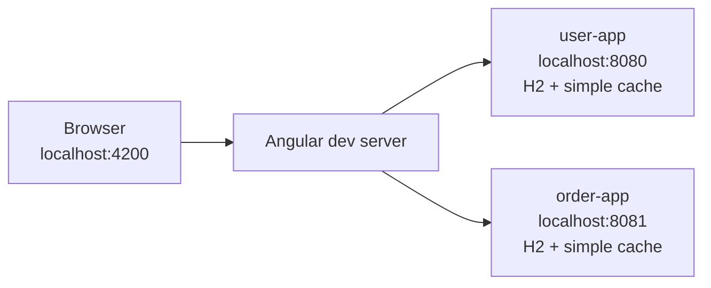
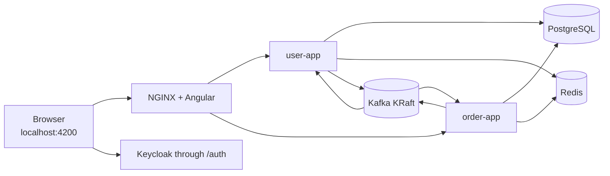

# Development Guide

This guide covers DevApp's two local workflows: a fast dependency-free loop and a production-shaped authenticated stack.

## Repository Layout

```text
devapp-common/       shared Java contracts and reusable infrastructure
user-app/            user REST API and order-validation consumer
order-app/           order REST API and result consumer
devapp-web/          Angular SPA, NGINX image, Vitest and Playwright tests
infra/ansible/       optional manual Kustomize apply helper
infra/argocd/        Argo CD Application bootstrap
infra/compose/       complete local runtime and Playwright acceptance overlay
infra/keycloak/      disposable Keycloak realm import
infra/k8s/           Kubernetes workloads, policies, secrets, and observability
infra/scripts/       CI/CD, image-tag, and task-runner helpers
.devcontainer/       VS Code application toolchain and optional infrastructure
.gitlab-ci.yml          CI, image publication, GitOps update, and acceptance
```

## Local Topologies

### Fast development profile



Defaults:

- authentication disabled in the SPA and services
- one seeded in-memory H2 database per service
- simple in-process Spring caches
- Kafka listeners and event publication disabled
- Flyway disabled; schema/data SQL initialize H2

This loop is for controller, service, persistence, and UI work that does not require runtime infrastructure.

### Complete local stack



The complete stack uses the `prod` Spring profile, Keycloak JWTs, PostgreSQL/Flyway, Redis, and Kafka. It is the local reference for production-shaped integration behavior.

## Toolchain

The repository currently targets:

- Java 25.0.4
- Maven 3.9.16
- Spring Boot 4.1.0
- Node.js 24 LTS
- npm 12.0.2
- Angular 22.1
- TypeScript 6.0
- Docker with Compose support
- optional: Mask task runner, kubectl, and VS Code Dev Containers

Docker builds the complete stack, so Java and Node are required on the host only for direct development.

## Fastest Complete Start

Build and start every application dependency:

```bash
docker compose -f infra/compose/compose.yaml up --build -d
docker compose -f infra/compose/compose.yaml ps
```

Open <http://localhost:4200> and use:

| Surface | Username | Password |
|---|---|---|
| DevApp | `user` | `password` |
| Keycloak admin at <http://localhost:8180/auth/admin> | `admin` | `admin` |

These credentials and the `devapp-smoke` client secret in the imported realm are public test values. Do not reuse them outside the disposable demo.

Useful endpoints:

| URL | Purpose |
|---|---|
| <http://localhost:4200> | application |
| <http://localhost:4200/api/docs> | aggregated Swagger UI |
| <http://localhost:4200/api/users/openapi> | user OpenAPI document |
| <http://localhost:4200/api/orders/openapi> | order OpenAPI document |
| <http://localhost:8180/auth> | direct local Keycloak |
| `localhost:29092` | host Kafka listener |

Follow and stop the stack:

```bash
docker compose -f infra/compose/compose.yaml logs -f user-app order-app
docker compose -f infra/compose/compose.yaml down
```

To discard PostgreSQL, Redis, and Kafka data as well:

```bash
docker compose -f infra/compose/compose.yaml down -v
```

That command is intentionally destructive to local Compose volumes.

## Fast Dependency-Free Start

Install backend and frontend dependencies once:

```bash
mvn -DskipTests install
cd devapp-web
npm ci
cd ..
```

Start these in separate terminals:

```bash
mvn spring-boot:run -pl user-app
mvn spring-boot:run -pl order-app
cd devapp-web && npm start
```

Open <http://localhost:4200>. The Angular development proxy routes:

- `/api/users` to `localhost:8080`
- `/api/orders` to `localhost:8081`
- `/api/docs` to `localhost:8080`
- `/auth` to `localhost:8180`

The development Angular environment has `authEnabled: false`, so Keycloak is not needed for this loop.

## Mask Commands

`maskfile.md` provides short task commands when Mask is installed:

```bash
mask install all
mask test all
mask coverage all
mask build all
mask run all
```

Component selectors:

- install/test/coverage/build: `back`, `front`, or `all`
- run: `user`, `order`, `front`, or `all`

Mask uses Java 25 when `infra/scripts/mask-helpers.sh` can locate it. Direct Maven/npm commands remain the authoritative fallback.

## VS Code Dev Container

`.devcontainer/` builds an application development image containing:

- Amazon Corretto Java 25
- Maven 3.9.16
- Node.js 24
- npm 12.0.2
- Angular CLI 22
- Java, Spring, Angular, TypeScript, YAML, Docker, database, and Git editor extensions
- persistent Maven and npm dependency volumes

Only the `devapp` workspace service starts automatically. PostgreSQL, Redis, Kafka, and Keycloak are behind the optional `local-infra` profile.

After opening the repository with **Reopen in Container**, use the normal direct commands. To opt into the dev-container infrastructure definition:

```bash
docker compose -f .devcontainer/docker-compose.yml --profile local-infra up -d
```

The roadmap keeps a stricter application-only dev-container direction: environment-specific development should point to shared infrastructure namespaces while local infrastructure remains explicit and optional.

## Backend Profiles

### Default `dev`

- H2 with PostgreSQL compatibility mode
- schema and seed SQL
- simple caches
- authentication disabled
- messaging disabled unless `KAFKA_ENABLED=true`
- readable DEBUG-oriented application/web/SQL logs
- H2 console enabled

### `test`

- separate in-memory H2 database per service
- Hibernate creates and drops tables for full-context security tests
- simple cache
- Kafka listener startup disabled
- test-specific property overrides

### `uat` and `prod`

- PostgreSQL connection from `DB_*`
- Flyway migrations and Hibernate validation
- Redis cache
- OAuth2 JWT resource server
- Kafka consumers/producers enabled by deployment configuration
- per-instance rate limit enabled
- H2 console disabled
- structured JSON logs

## Important Environment Variables

| Variable | Purpose | Complete-local value |
|---|---|---|
| `SPRING_PROFILES_ACTIVE` | Spring profile | `prod` |
| `DB_HOST`, `DB_PORT`, `DB_NAME` | PostgreSQL location | `postgres`, `5432`, `devappdb` |
| `DB_USERNAME`, `DB_PASSWORD` | PostgreSQL credential | disposable `devapp` values |
| `REDIS_HOST`, `REDIS_PORT` | Redis location | `redis`, `6379` |
| `REDIS_PASSWORD` | optional Redis password | empty locally |
| `KAFKA_BOOTSTRAP_SERVERS` | brokers | `kafka:9092` |
| `KAFKA_CONSUMER_GROUP` | service consumer group | service-specific |
| `KAFKA_ENABLED` | listener and messaging feature switch | `true` |
| `JWT_ISSUER_URI` | token issuer visible to clients | local proxied Keycloak issuer |
| `JWT_JWK_SET_URI` | internal key-set URL | Keycloak service URL |
| `CORS_ALLOWED_ORIGINS` | browser origins | `http://localhost:4200` |
| `RATE_LIMIT_REQUESTS_PER_MINUTE` | per-instance API limit | default `120` |

Spring relaxed binding also allows direct overrides such as `APP_SECURITY_ENABLED=false` and `APP_MESSAGING_ENABLED=false` for controlled smoke tests.

## Backend Configuration Files

- `user-app/src/main/resources/application.yml`
- `order-app/src/main/resources/application.yml`
- `*/src/main/resources/application-test.yml`
- `*/src/main/resources/logback-spring.xml`
- `*/src/main/resources/db/schema.sql`
- `*/src/main/resources/db/data.sql`
- `*/src/main/resources/db/migration/`

Both services deliberately use parallel configuration shapes. When changing a shared runtime concern, update and test both.

## Frontend Configuration

Environment files:

- `devapp-web/src/environments/environment.ts`: development, authentication disabled
- `devapp-web/src/environments/environment.uat.ts`: production-shaped auth
- `devapp-web/src/environments/environment.prod.ts`: production auth

The production and UAT UI use relative `/api` URLs and the canonical `https://keycloak.swirlit.dev/auth` issuer. The development UI keeps its local `/auth` proxy while authentication is disabled by default.

Frontend scripts:

```bash
cd devapp-web
npm start
npm run build
npm run build:uat
npm run build-prod
npm test
npm run test:coverage
npm run test:e2e
npm run test:integration
npm run analyze
```

## Adding A Backend Capability

Keep reusable concerns in the smallest sensible boundary:

- `devapp-common`: framework-neutral contracts or truly shared infrastructure
- owning service `domain`: persistence model
- owning service `dto`: public HTTP contract
- owning service `repository`: database access
- owning service `service`: transactions and orchestration
- owning service `controller`: HTTP mapping only
- owning service `config`: service-specific runtime wiring

Workflow:

1. Define the failure mode or reusable pattern being demonstrated.
2. Keep controller methods thin and API entities private.
3. Put transaction boundaries in the service or message listener.
4. Add Flyway and development-schema changes together.
5. Add success and failure tests at the narrowest useful layer.
6. Add full-context or container tests when infrastructure behavior matters.
7. Document configuration, observability, and removal/extension points.

Avoid putting service-owned JPA entities in `devapp-common`; that would couple persistence domains.

## Adding A Frontend Capability

The current app uses standalone components and functional providers.

1. Keep routes lazy where a separate surface is useful.
2. Put HTTP behavior in a service, not a component.
3. Keep models explicit and synchronized with supported API DTOs.
4. Handle loading, empty, success, and Problem Details failure states.
5. Prefer accessible labels, roles, and user-visible selectors.
6. Add a focused Vitest spec and extend Playwright only for a critical journey.
7. Keep the UI domain small unless a new technical pattern requires another state.

## Kafka Development Utilities

When using the dev-container Kafka service:

```bash
.devcontainer/scripts/kafka-setup.sh check
.devcontainer/scripts/kafka-setup.sh setup
.devcontainer/scripts/kafka-setup.sh list
.devcontainer/scripts/kafka-setup.sh describe
.devcontainer/scripts/kafka-setup.sh groups
.devcontainer/scripts/kafka-setup.sh consume order_topic
```

Application configuration creates request, result, and DLT topics when messaging is enabled. The helper currently focuses on the two primary topics.

## Troubleshooting

### Frontend loads but API calls fail

Check both services and the development proxy:

```bash
curl http://localhost:8080/actuator/health
curl http://localhost:8081/actuator/health
```

Then verify `devapp-web/proxy.conf.json` and ensure ports `8080` and `8081` are free.

### Complete stack remains unhealthy

```bash
docker compose -f infra/compose/compose.yaml ps
docker compose -f infra/compose/compose.yaml logs postgres redis kafka keycloak
docker compose -f infra/compose/compose.yaml logs user-app order-app web
```

Applications wait for dependency health checks. Keycloak and Kafka can take longer on their first image pull/start.

### JWT validation fails locally

Issuer equality matters. The browser-visible issuer, token `iss` claim, and `JWT_ISSUER_URI` must match. `JWT_JWK_SET_URI` may use the internal Keycloak service address because it is used only to fetch keys.

### Production profile reports schema validation errors

Read Flyway logs and inspect the service-specific history table. Do not switch Hibernate back to `update`; correct the missing migration.

### A Maven module cannot resolve `devapp-common`

Run from the repository root with `-am` or install the reactor first:

```bash
mvn -DskipTests install
mvn spring-boot:run -pl user-app
```

### Local ports are already occupied

Expected host ports are `4200`, `8080`, `8081`, `8180`, and `29092`. PostgreSQL and Redis are internal in the root Compose stack. Stop the conflicting process or adjust the local topology rather than killing unrelated containers blindly.

## Related Guides

- [Features](./features.md)
- [Data Model](./data-model.md)
- [Testing](./testing.md)
- [Deployment](./deployment.md)
- [Security](./security.md)
