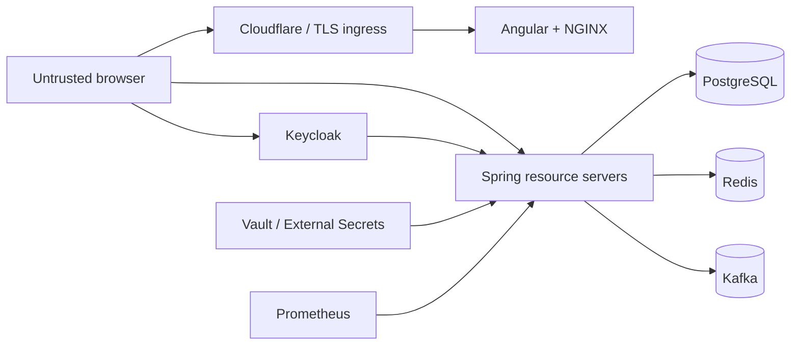

# Security Reference

This document describes DevApp's implemented security posture, trust boundaries, and limitations. It is a reusable baseline, not a compliance certification or a substitute for threat modeling the application created from this template.

## Security Posture Summary

Implemented controls:

- Keycloak OpenID Connect identity provider
- Authorization Code flow with PKCE `S256`
- public SPA client with no browser-held client secret
- disabled password-grant flow
- Spring Security OAuth2 JWT resource servers
- stateless bearer-token APIs
- authentication required for application APIs in UAT/production
- Angular route guard and bearer-token interceptor
- narrow CORS policy
- body/path/query validation and explicit DTO boundaries
- Problem Details responses that do not expose stack traces
- fail-fast conflict checks plus database constraints
- per-principal/IP in-process rate limiting
- request-ID validation and correlation
- H2 console disabled and disallowed in production
- HTTPS-only public ingress
- Actuator absent from public ingress
- Vault and External Secrets for deployed credentials
- non-root, read-only, capability-dropped containers
- network restrictions for application ingress
- security integration tests for anonymous and JWT-authenticated requests

Important limitations:

- no business roles or method-level authorities yet
- no distributed/global rate limit
- API documentation is intentionally public
- Prometheus endpoint is unauthenticated inside the cluster
- no application field encryption/KMS example
- no data export, erasure, anonymization, or retention workflow
- no automated SAST, DAST, SBOM signing, or policy gate in GitLab CI
- Kafka transport/authentication is supplied by the environment and the local demo is plaintext
- no OpenTelemetry trace propagation across service events

## Trust Boundaries

Security assumptions:

- Cloudflare and NGINX Ingress provide the public edge and TLS path.
- Keycloak is authoritative for authentication and credential policy.
- APIs independently validate access tokens; frontend guards are not a security boundary.
- PostgreSQL is authoritative for application data.
- Kafka records are untrusted input at consumer boundaries even when produced internally.
- Redis is a cache only and must not hold unique authoritative state.
- Vault and cluster secret delivery are trusted platform services.

## Authentication Flow

Production browser flow:

1. Angular loads Keycloak discovery from the canonical `https://keycloak.swirlit.dev/auth` issuer.
2. The login button starts Authorization Code flow.
3. Keycloak authenticates the user.
4. PKCE binds the returned authorization code to the initiating browser.
5. Angular obtains an access token and tracks auth state.
6. `authGuard` allows protected routes after authentication initialization.
7. `authInterceptor` adds `Authorization: Bearer <token>` to API requests, excluding Keycloak `/auth/` requests.
8. Each Spring resource server validates signature, issuer, time claims, and token structure through the configured JWK set.

Keycloak realm controls in `infra/keycloak/realm.json`:

- `sslRequired: external`
- registration disabled
- public `devapp-web` client
- standard flow enabled
- direct access grants disabled
- PKCE method `S256`
- explicit local, container, and live redirect origins
- one disposable demonstration user

The realm also contains a confidential `devapp-smoke` service-account client with a public demo secret. Treat it exactly like the sample user credentials: safe only in the disposable example realm, never as a production secret.

## Password And Credential Handling

Passwords never pass through `user-app`, `order-app`, PostgreSQL application tables, Redis caches, Kafka events, or API DTOs.

Keycloak owns:

- password hashing
- credential storage
- login policy
- account lockout/brute-force policy when configured at the realm level
- signing keys and token issuance

Rules for adopters:

- configure real realm password and brute-force policies outside the disposable export
- require temporary or generated passwords for bootstrap users
- remove demo clients/users from production realms
- never log passwords, authorization codes, access/refresh tokens, or client secrets
- rotate identity-provider keys and secrets through managed procedures

Do not add a password field to the DevApp `User` entity merely because it has a username/email. Authentication identity and demonstration application profile are separate concerns.

## Backend Authorization

With `app.security.enabled=true`, the services permit these without a bearer token:

- `/actuator/health/**`
- `/actuator/info`
- `/actuator/prometheus`
- `/api/docs/**`
- `/api/swagger-ui/**`
- `/swagger-ui/**`
- each service's OpenAPI document

Every other request requires authentication.

The Kubernetes ingress exposes API documentation but not Actuator. Health and metrics remain reachable on cluster services for probes, Prometheus, and GitLab CI smoke checks.

Current access policy is authenticated-or-public; there are no roles, scopes, ownership rules, or `@PreAuthorize` examples. That is acceptable only because the demonstration domain has one shared directory/order space. A real application must add resource-specific authorization before storing multi-user data.

`app.security.enabled=false` is the developer escape hatch. It is the default profile behavior and must not be enabled in an internet-facing environment.

## Frontend Route Protection

Protected routes:

- `/users`
- `/orders`

Public route:

- `/login`

The guard waits until discovery/login initialization completes before deciding whether to allow or redirect. This avoids treating a still-loading session as anonymous.

Route guards are navigation behavior only. Attackers can call APIs without loading the SPA, so Spring Security remains authoritative.

## API Input And Output Controls

Requests use typed DTOs with Jakarta Validation:

- required/length/pattern/email constraints for user creation
- positive user/product IDs for order creation
- positive path IDs
- bounded collection limits
- malformed JSON/type handling

Responses use explicit DTOs and omit:

- entity implementation details
- `createdBy` and `lastModifiedBy`
- optimistic-lock `version`
- persistence relationships/proxies

Problem Details expose stable status/title/detail and validation maps. Unexpected errors return a generic message while the server logs the exception. Database conflicts do not echo SQL or the rejected record.

`X-Request-Id` accepts only `[A-Za-z0-9._:-]` up to 100 characters; unsafe values are replaced with a UUID. This prevents log/JSON injection through the correlation identifier.

## CORS

Configured behavior:

- allowed origins from `app.cors.allowed-origins`
- methods: `GET`, `POST`, `OPTIONS`
- request headers: `Authorization`, `Content-Type`
- credentials allowed
- one-hour preflight cache
- exposed headers: `Location`, `X-Request-Id`, rate-limit headers, `Retry-After`

Default local origin: `http://localhost:4200`.

Production must provide the exact allowed origin list. Do not introduce `*` while credentials are allowed.

## CSRF And Sessions

Backends use stateless bearer authentication and disable CSRF. They do not use a server-side browser session cookie for application APIs.

This choice is correct only while API authentication remains in an `Authorization` header rather than an automatically attached application cookie. If the template moves to a backend-for-frontend or cookie session, revisit CSRF protection, SameSite, Secure, HttpOnly, and session fixation controls.

Keycloak maintains its own login session and has separate cookie/security responsibilities.

## Rate Limiting

Production enables a fixed 60-second window:

- key: authenticated principal, otherwise remote IP visible to the service
- default: 120 API requests per minute
- scope: `/api/**`, excluding OPTIONS and documentation paths
- bounded client map with expired-entry cleanup and overflow protection
- response budget headers on accepted requests
- `429` Problem Details plus `Retry-After` after exhaustion

Limitations:

- counters are local to one JVM
- restarts reset counters
- replicas do not share usage
- it is not a volumetric DDoS defense
- proxy identity correctness depends on the trusted forwarded-header/ingress path

Use Cloudflare/API-gateway or a shared distributed limiter for global enforcement. Keep the application filter as defense in depth.

## HTTPS And Browser Headers

NGINX Ingress:

- terminates TLS for `devapp.swirlit.dev`
- forces SSL redirect
- forwards scheme/host information

Spring uses the framework forwarded-header strategy so secure-request handling and default security headers see the proxied HTTPS scheme.

NGINX serving the SPA adds:

- `X-Content-Type-Options: nosniff`
- `Referrer-Policy: strict-origin-when-cross-origin`
- `X-Frame-Options: DENY`
- hidden NGINX version tokens

The backend relaxes frame options to same-origin only when security is disabled for local H2 console use. Production keeps the security default.

A project-specific Content Security Policy and Permissions Policy are not configured yet and should be added/tested before using third-party scripts or sensitive browser capabilities.

## Data Privacy

Potential personal data:

- display name
- username
- email
- created/modified principal identifiers
- structured logs and browser-test artifacts

Current minimization:

- no passwords in application systems
- DTOs exclude audit principals/version
- no request-body logging
- generic unexpected-error responses
- list limits reduce accidental bulk exposure
- production APIs require authentication

Not implemented:

- purpose/consent records
- retention and scheduled purge
- user export
- deletion/anonymization
- field-level encryption
- data classification labels

Email is displayed by the demo and cannot be irreversibly hashed. Platform volume/backup encryption should protect data at rest; application-level envelope encryption with managed KMS is appropriate when the threat model requires field confidentiality from database operators or backups.

Auditing timestamps and principals are not a complete security audit trail. Sensitive actions need immutable, access-controlled audit events with retention and review policy.

## Kafka And Event Security

Consumers validate required identifiers, allowed statuses, persisted identity, and state transitions. Invalid events fail rather than silently mutating the wrong order.

Reliability controls such as idempotent production, retries, and DLT are not security controls by themselves.

Environment responsibilities:

- broker authentication/authorization
- transport encryption
- topic ACLs
- credential rotation
- retention and quota policy
- network isolation

The local Kafka demo is plaintext and unauthenticated. Do not expose port `29092` publicly.

Events currently contain order/user/product IDs and resolved user name. Avoid adding email, tokens, credentials, or unnecessary personal data to events. DLT retention can extend the life of a failed payload and must be included in privacy policy.

## Caching Security

Redis stores serialized user and order objects in production cache regions for ten minutes.

Requirements for real deployments:

- keep Redis network-private
- authenticate/encrypt transport when platform capabilities support it
- avoid caching credentials/tokens
- review personal-data exposure in cache and backups
- use isolated key prefixes/databases when sharing Redis
- ensure eviction after security-sensitive updates

The cache is not an authorization decision store.

## Secrets And Supply Chain

Deployed secret flow:

- PostgreSQL and GitLab credentials originate in Vault
- External Secrets creates namespace-scoped Kubernetes Secrets
- image pull credentials are mounted only where required
- GitLab CI injects Maven/npm/registry/Git configuration through Secrets
- Git credential prompting uses a temporary askpass file removed after push

Container hardening:

- digest-pinned CI and base images
- runtime images contain verified artifacts only in GitLab CI
- fixed non-root users
- dropped capabilities
- read-only root filesystem in Kubernetes
- no application service-account token

Still required for a stronger supply-chain posture:

- published and signed SBOMs
- image signing/verification and provenance
- SAST/DAST
- admission policy checks
- base-image vulnerability policy

SonarQube analysis runs automatically in full-mode `02-quality` on the default branch independently of optional manual `01-e2e`; standard mode exposes quality as an optional manual job. The scanner imports JaCoCo and LCOV coverage, submits without waiting for the quality gate, and authenticates with a masked project-scoped token. The reporting job retains dependency-audit output and is allowed to fail, so findings never block `01-release`. Compilation and package validation remain required; unit tests and the 80 percent coverage policy are visible, non-blocking jobs.

`03-security` uses a digest-pinned Trivy image to scan dependency manifests, infrastructure-as-code, and the repository working tree for vulnerable packages, misconfigurations, and exposed secrets. It retains JSON and SARIF reports for seven days and exits nonzero for high/critical findings, while `allow_failure` keeps the signal optional. The job is numbered after quality but has no dependency on it: it is manually runnable in standard mode and runs automatically in full mode.

## Actuator And Observability

Actuator health and metrics are unauthenticated at the Spring filter level for probes/scraping. The external boundary is Kubernetes networking:

- no public ingress route
- ClusterIP services only
- NetworkPolicy allows Prometheus, ingress for application traffic, same-namespace pods, and GitLab CI smoke agents

Logs include stack traces for internal unexpected failures. Ensure log access is restricted and add redaction tests before logging richer arguments or contexts.

The custom database health indicator includes record counts in health details. Spring uses `show-details: when-authorized`; review operational role configuration before exposing details beyond trusted cluster callers.

## Security Testing

Current tests verify:

- anonymous API request receives `401`
- JWT-authenticated request reaches a secured controller
- body/path/query validation failures
- malformed JSON handling
- response DTOs omit private entity fields
- safe/unsafe request-ID behavior
- rate-limit enforcement
- Kafka identity/status/state validation
- transient failures are retried rather than misclassified
- duplicate event outcome is idempotent
- frontend guard/interceptor/auth initialization
- real Authorization Code + PKCE browser login

The next authorization suite should add roles and wrong-role cases. Threat-focused tests should add CORS, security headers, token edge cases, redaction, and edge/global throttling.

## Security Review Checklist

Before merging a sensitive change:

- Is authorization enforced by the backend, not just the UI?
- Are public paths intentionally public in both Spring Security and ingress?
- Does every new request field have validation and a size bound?
- Does the response DTO expose only supported fields?
- Could logs, Problem Details, metrics, events, DLTs, caches, or test artifacts reveal secrets/personal data?
- Are new credentials sourced outside Git and scoped minimally?
- Does the change alter issuer, redirect URI, CORS, or proxy trust?
- Is retry behavior safe and bounded?
- Is message processing idempotent under duplicates/restarts?
- Are migrations backward compatible with rollback?
- Do tests cover anonymous, invalid, failure, and replay paths?
- Are operational detection and recovery documented?

## Related Guides

- [Features](./features.md)
- [Data Model](./data-model.md)
- [Deployment](./deployment.md)
- [Operations](./operations.md)
- [Testing](./testing.md)
- [Architecture and ADRs](./architecture.md)
